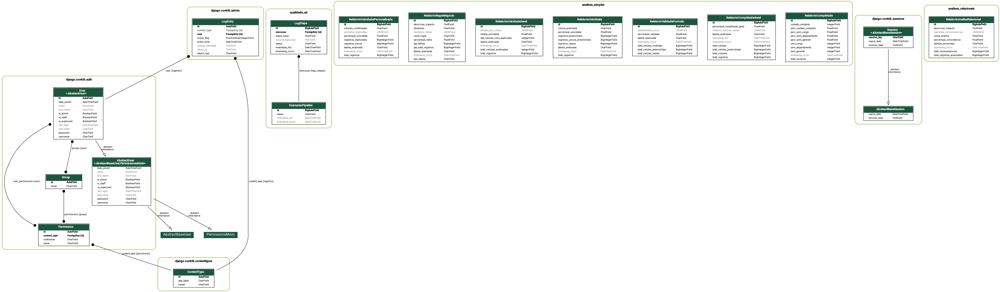

APEX GOVERNANCE: Plataforma de Governança e Qualidade de Dados
==============================================================

.. image:: _static/logo.png
   :align: center
   :alt: APEX Governance Logo
   :width: 200px

Resumo
------

O **APEX GOVERNANCE** é uma plataforma de engenharia de dados projetada para auditar,
monitorar e garantir a qualidade dos dados do Active Directory corporativo.

O sistema opera através de um pipeline de dados automatizado que transita informações
entre camadas de **Staging** (dados brutos) e **Produção** (dados tratados), aplicando
regras de negócio rigorosas e métricas de qualidade (Completude, Unicidade, Validade e Consistência).

.. contents:: Navegação Rápida
   :local:
   :depth: 2

------------------------------------------------------------
Arquitetura do Sistema
------------------------------------------------------------

O projeto segue uma arquitetura modular baseada em eventos:

1.  **Core (Django):** Gerencia a interface web, autenticação e modelos de dados.
2.  **Workers (Celery):** Executam tarefas pesadas (ETL e Análises) de forma assíncrona.
3.  **Broker (Redis):** Gerencia a comunicação entre o Core e os Workers.

------------------------------------------------------------
Funcionalidades Principais
------------------------------------------------------------

O sistema é composto pelos seguintes módulos principais:

**1. Pipeline de ETL (`qualidade_ad`)**
   Responsável pela ingestão de dados.
   
   * Extração via LDAP ou Importação Local.
   * Higienização de CSVs (Pandas).
   * Preparação dinâmica do Banco de Dados.
   * Carga para Staging e Transformação para Produção.

**2. Motor de Análises (`analises_simples`)**
   Responsável pela aplicação das regras de qualidade DAMA DMBOK.
   
   * **Completude:** Verifica campos obrigatórios (Geral e Específica).
   * **Validade:** Valida formatos de dados (Tipagem, UUIDs, Datas).
   * **Unicidade:** Verifica duplicidades em chaves primárias e compostas.
   * **Regras de Negócio:** Motor flexível para auditorias complexas (SQL).

**3. Importador Dinâmico (`importador_dinamico`)**
   Ferramenta administrativa para carga de dados arbitrários, criação
   automática de bancos de dados e tabelas.

------------------------------------------------------------
Documentação dos Módulos (API Reference)
------------------------------------------------------------

Abaixo encontra-se a documentação técnica gerada automaticamente a partir
do código-fonte (Docstrings).

.. toctree::
   :maxdepth: 2
   :caption: Pacotes e Módulos
   :titlesonly:

   modules

------------------------------------------------------------
Guias Complementares
------------------------------------------------------------

.. toctree::
   :maxdepth: 1
   :caption: Guia do Desenvolvedor
   :hidden:

   developer/setup_linux
   developer/architecture_diagram
   developer/database_schema

.. toctree::
   :maxdepth: 1
   :caption: Regras de Negócio
   :hidden:

   rules/completeness
   rules/validity
   rules/consistency

------------------------------------------------------------
Informações do Projeto
------------------------------------------------------------

* **Autor:** Sergio Santana dos Santos
* **Stack:** Python 3.12, Django 5.2, Celery, Redis, PostgreSQL.
* **Licença:** Proprietária / Acadêmica.
* **Copyright:** © 2025 APEX Governance.

Add your content using ``reStructuredText`` syntax. See the
`reStructuredText <https://www.sphinx-doc.org/en/master/usage/restructuredtext/index.html>`_
documentation for details.

